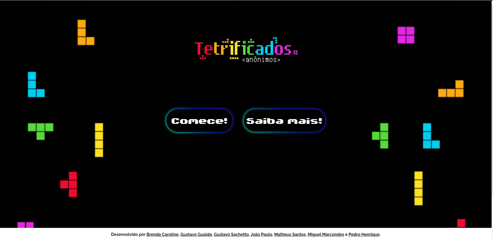

# Tetrificados
## Visão Geral

O site Tetrificados foi um desenvolvido para ser a página Home de vários jogos, os jogos foram criados por toda a Sala do 2º Info da Etec Dr. Emílio Hernandez.  
Porém os colaboradores desse projeto foi: <a href="https://github.com/dartres" target="_blank">Brenda Caroline</a>,
            <a href="https://github.com/iCrowleySHR" target="_blank">Gustavo Gualda</a>, 
            <a href="https://github.com/GustavoSachetto" target="_blank">Gustavo Sachetto</a>, 
            <a href="https://github.com/jubileuwu" target="_blank">João Paulo</a>, 
            <a href="https://github.com/matheussantosrodrigues" target="_blank">Matheus Santos</a>,
            <a href="https://github.com/Miguelzzzz" target="_blank">Miguel Marcondes</a> e 
            <a href="https://github.com/phpparker" target="_blank">Pedro Henrique</a>.

## Funcionalidades

- **Jogos:** Se aventure no mundo dos Tetris!! Nele você pode encontrar uma grande diversidade de jogos! Onde por exemplo, você pode navegar no mundo Tetris na Fenda do Biquini. Ou no mundo do Mario!
- **Quantidade de jogos:** No nosso projeto existe **12** jogos!

## Tecnologias Utilizadas

